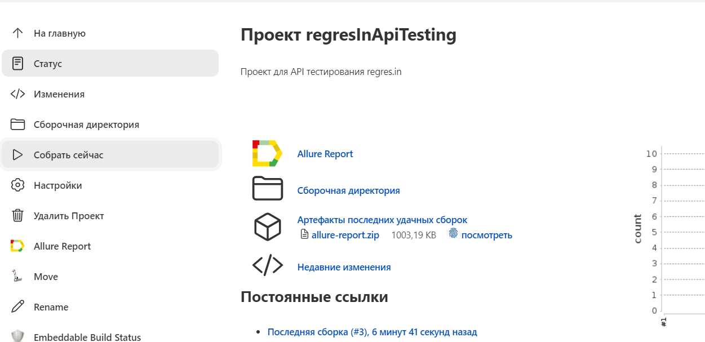
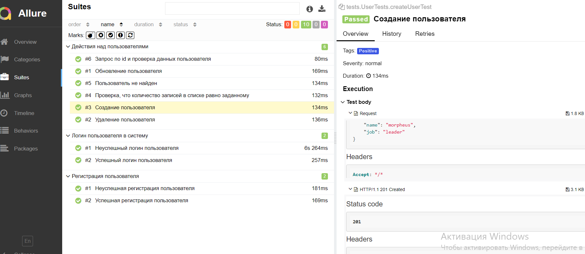
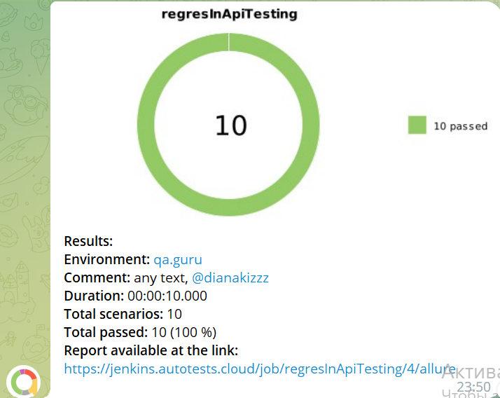

# Проект по API тестам для [reqres.in](https://reqres.in/)

<p align="center">

</p>

##  Содержание:

- [Технологии и инструменты](#technologist-технологии-и-инструменты)
- [Запуск тестов](#-запуск-тестов)
- [Запуск тестов в Jenkins](#-запуск-тестов-в-jenkins)
- [Отчет о результатах тестирования в Allure Report](#-отчет-о-результатах-тестирования-в-Allure-report)
- [Уведомления в Telegram](#-уведомления-в-telegram)

##  Технологии и инструменты

<p align="left">
<a href="https://www.jetbrains.com/idea/"></a>
<a href="https://www.java.com/"></a>
<a href="https://gradle.org/"></a>
<a href="https://junit.org/junit5/"></a>
<a href="https://github.com/"></a>
<a href="https://github.com/allure-framework/allure2"></a>
<a href="https://qameta.io/"></a>
<a href="https://www.jenkins.io/"></a>
<a href="https://web.telegram.org/"></a>
</p>

## Тест кейсы

- [x] Успешная регистрация пользователя
- [x] Неуспешная регистрация пользователя
- [x] Успешный логин пользователя
- [x] Неуспешный логин пользователя
- [x] Создание пользователя
- [x] Обновление пользователя
- [x] Удаление пользователя
- [x] Неуспешный поиск пользователя
- [x] Проверка, что количество записей в списке равно заданному


# Запуск тестов

Для  запуска тестов:
```shell
gradle clean test 
```

Получение отчёта:
```bash
allure serve build/allure-results
```

##  Запуск тестов в [Jenkins](https://jenkins.autotests.cloud/job/diploma_project_mobile/)

###Сборка проекта:
- Открыть <a target="_blank" href="https://jenkins.autotests.cloud/job/regresInApiTesting/">проект</a>
- Нажать **Собрать**
- Результат запуска сборки можно посмотреть в отчёте Allure
<p align="center">
  
</p>

##  Отчет о результатах тестирования в [Allure Report](https://jenkins.autotests.cloud/job/diploma_project_mobile/1/allure/)

<p align="center">
  
</p>

##  Уведомления в Telegram
После завершения сборки специальный бот, созданный в <code>Telegram</code>, автоматически обрабатывает и отправляет сообщение с отчетом о прохождении тестов.

<p align="center">



[Вернуться к началу ⬆](#Wikipedia)